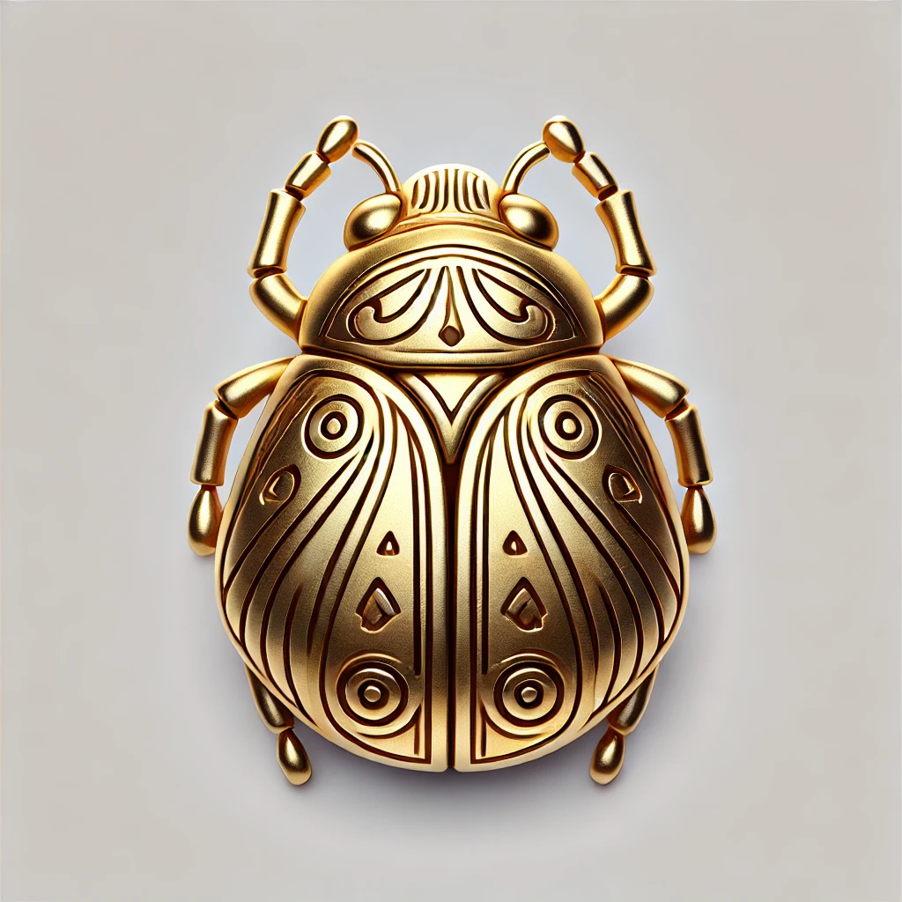

# Scarab Entity Simulation Framework

</img>

Scarab is an _entity-based_, _time stepped_, _discrete event_ simulation framework written in Python.

* _Entity-based_ means that the simulation is made up of individual entities that have state and respond to events that
  can change the state.
* _Time stepped_ means that the simulation steps through time, one step at a time. The interpretation of a step is up to
  the simulation, such that is can be a second, minute, day or year.
* _Discrete event_ means that events are points in time events and not continuous functions. While they can represent a
  continuous change, such as acceleration, the actual changes are based on the time steps.

For example, imagine a traffic flow simulation. It would consist of _entities_, such as cars and traffic lights, that
would change state based on _events_, such as _time updates_ and changes in state of other entities. A traffic light
turns green, so the car starts to move. The car moves a distance for each time increment based on velocity,
acceleration, etc.

## License

This project is licensed under the MIT License. See the [LICENSE](LICENSE) file for details.

Scrab is a "passion project" and as such no support is provided. But if you have questions or find bugs, please let me
know.

## Installation

Scarab requires Python 3.7 or later to run. Additional dependencies can be found in the setup.py file.

The easiest way to install is to use `git` and `pip` and install directly from GitHub using the following command:

~~~
pip install --upgrade git+https://github.com/billdback/scarab
~~~

NOTE: it's recommended that you first create a virtual environment before installing.

### Verifying the installation

You can verify that they install works, by running the following commands:

~~~
python -m scarab.ws_event_logger
python -m scarab.simple_sim
~~~

You should see a list of commands displayed to the screen like the following:

~~~
{"event_name": "scarab.entity.created", "sim_time": 1, "entity": {"scarab_name": "basic-entity", "scarab_id": "62d6dc1d-6289-452c-bb84-79a4f36113fd", "name": "basic-entity0", "number_entities": 10, "entity_changes": 0, "scarab_conforms_to": null}}
{"event_name": "scarab.entity.created", "sim_time": 1, "entity": {"scarab_name": "basic-entity", "scarab_id": "99634958-9ac1-4a9f-b2b7-27d85c0dbea4", "name": "basic-entity1", "number_entities": 10, "entity_changes": 0, "scarab_conforms_to": null}}
{"event_name": "scarab.entity.created", "sim_time": 1, "entity": {"scarab_name": "basic-entity", "scarab_id": "375b605f-b0c3-4245-b969-20e39746f40a", "name": "basic-entity2", "number_entities": 10, "entity_changes": 0, "scarab_conforms_to": null}}
{"event_name": "scarab.entity.created", "sim_time": 1, "entity": {"scarab_name": "basic-entity", "scarab_id": "f5bd97a7-d58e-4657-878a-d919d28e23e5", "name": "basic-entity3", "number_entities": 10, "entity_changes": 0, "scarab_conforms_to": null}}
~~~

### Run an example

You can also verify the installation by running one of the examples:

## Available Scripts

After installing the Scarab package, the following command-line scripts are available:

### scarab-beehive

Runs the beehive simulation with a web UI that visualizes bees warming and cooling a hive.

```
scarab-beehive [config]
```

Arguments:
- `config`: Optional path to a TOML configuration file (defaults to the bundled example.toml)

The simulation opens a web browser to display the UI at http://localhost:8888.

### scarab-simple-sim

Runs a simple simulation with basic entities that monitor each other and generate events.

```
scarab-simple-sim [--host HOST] [--port PORT] [--steps STEPS] [--step-length STEP_LENGTH] [--entities ENTITIES]
```

Arguments:
- `--host`: WebSocket host (default: localhost)
- `--port`: WebSocket port (default: 1234)
- `--steps`: Number of simulation steps (default: 10)
- `--step-length`: Length of each step in milliseconds (default: 5)
- `--entities`: Number of entities to create (default: 10)

### scarab-ws-cli

Provides a command-line interface for controlling simulations via WebSocket.

```
scarab-ws-cli [--host HOST] [--port PORT]
```

Arguments:
- `--host`: WebSocket host (default: localhost)
- `--port`: WebSocket port (default: 1234)

Available commands:
- `help`: Shows the help message
- `start`: Starts simulation execution
- `pause`: Pauses simulation execution
- `resume`: Resumes simulation execution
- `shutdown`: Shuts down the simulation
- `exit`: Exits the CLI

### scarab-ws-event-logger

Connects to a simulation's WebSocket server and logs all events to the console.

```
scarab-ws-event-logger [--host HOST] [--port PORT]
```

Arguments:
- `--host`: WebSocket host (default: localhost)
- `--port`: WebSocket port (default: 1234)

## Scarab concepts

### Simulation

A simulation is a container for entities. It manages the lifecycle of entities as well as the routing of events
and messages between entities.

~~~
with Simulation() as sim:
    # add entities
    sim.run() 
~~~

### Events

Events are simply a message with properties that occur at a given time.

~~~
{
    "entity": {
        "scarab_name": "bee",
        "scarab_id": "5b6d9464-f3a8-4795-b730-34029cfbecf6",
        "isBuzzing": false,
        "isFlapping": false
    },
    "event_name": "scarab.entity.created",
    "sim_time": 0
}
~~~

### Entities

Entities are individual models that contain state and respond to events in the simulation. Entities
receive events by registering handlers for events. When an event is sent in the simulation, the simulation
looks for all the handlers for that given event type and calls the appropriate handler.

Note that all handlers (and entities) are identified by strings and not class names. This design is to allow
simulations to be composed of a variety of classes that are defined on how entities and events appear to other entities.
That is, entities and events are known by their properties. For example, a car entity may represent mulitple types of
cars, but to other entities they are defined by make, model, number of wheels, etc.

The following are the handler decorators and desciptions of the handlers. Each is given as an example method signature
to show the expected parameters. Note that the names of the handlers parameters aren't rigid, though consistency
aids in reading and reusing code.

~~~
@entity_created_event_handler(entity_nane="some-entity")
handle_some_entity_created(self, entity):
~~~

Handles the notification that an entity was created. The entity is not the original class, but rather a representation
of the entity's public properties.

~~~
@entity_destroyed_event_handler(entity_nane="some-entity")<br/>
handle_some_entity_destroyed(self, entity):
~~~

Handles the notification that an entity was destroyed (removed from the simulation). The entity is not the original
object, but rather a representation of the entity's public properties.

~~~
@entity_changed_event_handler(entity_nane="some-entity")<br/>
handle_some_entity_changed(self, entity, changed_properties):
~~~

Handles the notification that an entity's properties changed. The entity is not the original object, but rather a
representation of the entity's public properties. The changed_properties is a list of the properties that changed.

~~~
@time_update_event_handler()<br/>
handle_time_update(self, new_time, previous_time):
~~~

Handles notification of time changes in the simulation. The new time is the new time in the simulation. The
previous_time is the time of the last update.

~~~
`@simulation_shutdown_event_handler()<br/>
handle_simulation_shutdown(self):
~~~

Handles the notification that the simulation is shutting down.

~~~
@event_handler(event_name="some-event")<br/>
handle_event(self, event):
~~~

Defines a handler for a given event name. This handler is the default for all events and is used when a more
specific handler isn't available. Note that it is possible to write complete simulations that do not use this handler
since the specific handlers are sufficient.

## UI

You have a number of options for the UI. Some simulations will run and then print results, some might print results
during execution to the console. However, by default the simulation will open a websocket server and send all events
that are generated. This allows you to create a wide variety of UIs, in particular using web clients. The `beehive`
simulation has a web client that uses the websocket approach.

## Examples

[Beehive Simulation](./scarab/examples/beehive/README.md)

## Releases

Releases are planned around specific sets of functionality. In addition to the high level theme, new and
improved examples are also planned. There are no specific release dates or timelines since this is a passion project.

### Version 1.0 (Complete)

Theme: Minimum Viable Product (MVP)

Version 1.0 provides the ability to make a stand-alone simulation with entities and events. It includes an example
simulation called beehive (see scarab.examples) that demonstrates the functionality.

Main features:

* Simulation container to hold and manage entities
* Entities with handlers and state management
* Event interest and routing
* Websocket for controllers and UIs.
* Test simulation for testing entities.

### Version 2.0

Theme: Increased entity behavior and ease of development

The focus of version 2.0 will to increase entity behavior by allowing entities to send events and make development of
UIs easier. Some features planned include:

* Allow entities to send events. In v1 events are generated by entity state changes, but they cannot send events.
* Add support for "commands", which are messages targeted to specific entities.
* Add a JS (TS?) library for UI development. Currently, web UIs must parse and handle events from JSON.
* Additional example sim to demonstrate the new features.
* A tutorial to help users learn to use the framework.

### Version 3.0

Theme:  Simulation completeness

The focus of version 3.0 is to add any remaining features to enable complete simulation development, including
verification and validation and testing.
